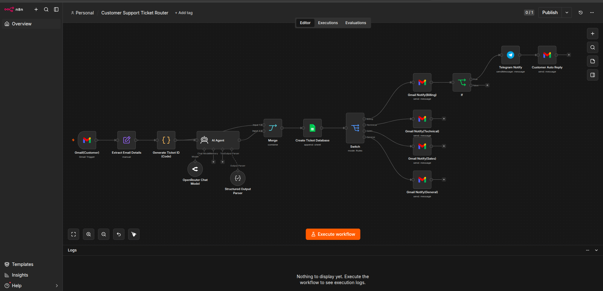
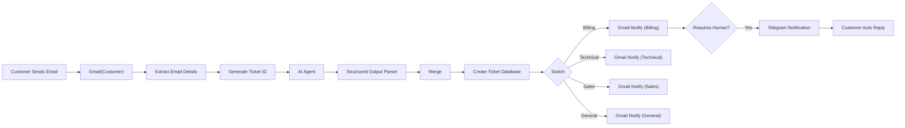

# 📄 AI Customer Support Email Triage System using n8n


An AI-powered customer support automation workflow built using **n8n**, **OpenRouter AI**, **JavaScript**, **Gmail API**, and **Google Sheets**.

The workflow automatically monitors incoming customer emails, extracts important information, generates unique support ticket IDs, classifies each email using Artificial Intelligence, stores tickets inside Google Sheets, and automatically routes notifications to the appropriate department including **Billing**, **Technical**, **Sales**, and **General Support**.

---

# 📸 Workflow Overview

<p align="center">

</p>

---

# 🎯 Project Overview

## Problem

Customer support teams receive numerous emails every day from customers requesting assistance with technical issues, billing concerns, product inquiries, account management, refunds, and general questions.

Manually reviewing every email creates several challenges:

- Reading every email individually
- Determining the correct department
- Prioritizing urgent requests
- Creating support tickets manually
- Updating ticket databases
- Routing emails to the correct team
- Maintaining consistent classifications
- Delayed response times

As the number of incoming emails grows, customer support becomes increasingly difficult to manage efficiently.

---

# 💡 Solution

This project automates the customer support triage process using Artificial Intelligence.

Instead of manually reviewing every email, the workflow automatically:

1. Monitors incoming Gmail messages.
2. Extracts customer information.
3. Generates a unique support ticket.
4. Uses AI to classify the email.
5. Determines the ticket category.
6. Assigns a priority level.
7. Detects customer sentiment.
8. Identifies customer intent.
9. Determines the responsible department.
10. Stores the ticket inside Google Sheets.
11. Routes notifications to the correct department.
12. Sends Telegram alerts for billing tickets requiring human review.
13. Automatically acknowledges the customer via email.

---

# ✨ Features

## 📧 Email Automation

- ✅ Gmail Trigger Integration
- ✅ Automatic Email Monitoring
- ✅ Email Metadata Extraction
- ✅ Customer Information Extraction
- ✅ Automatic Ticket Generation
- ✅ Unique Ticket ID Creation

---

## 🤖 Artificial Intelligence

- ✅ AI Email Classification
- ✅ Ticket Categorization
- ✅ Priority Detection
- ✅ Customer Sentiment Analysis
- ✅ Customer Intent Recognition
- ✅ Team Assignment
- ✅ AI Ticket Summary
- ✅ Human Review Detection
- ✅ Confidence Score Prediction

---

## 📋 Ticket Management

- ✅ Automatic Ticket Creation
- ✅ Ticket Status Tracking
- ✅ Google Sheets Database
- ✅ Organized Ticket Records
- ✅ AI Classification Results
- ✅ Customer History Storage

---

## ⚙ Workflow Automation

- ✅ Gmail Trigger Automation
- ✅ Automatic Ticket ID Generation
- ✅ Structured Output Parser
- ✅ Merge Node
- ✅ Google Sheets Ticket Database
- ✅ Switch-based Department Routing
- ✅ Billing Team Notification
- ✅ Technical Team Notification
- ✅ Sales Team Notification
- ✅ General Support Notification
- ✅ Human Review Detection
- ✅ Telegram Escalation
- ✅ Customer Auto Reply

---

# 🗺️ Workflow Architecture



---

# 🏗 Workflow Implementation

This workflow consists of **14 automation nodes** that process incoming customer emails from start to finish.

Each node performs a specific responsibility, beginning with monitoring Gmail and ending with department notification, ticket logging, Telegram escalation, and automatic customer acknowledgment.

The following sections explain every node in detail.
# 🏗 Workflow Implementation

This workflow consists of **14 interconnected automation nodes** that process every incoming customer support email from start to finish.

Each node performs a specific responsibility, beginning with email collection and ending with intelligent routing, ticket storage, escalation, and customer acknowledgment.

---

# Node 1 — Gmail (Customer)

## Purpose

The Gmail Trigger continuously monitors the support inbox for newly received customer emails.

Whenever a new email arrives, the workflow starts automatically without any manual intervention.

### Captured Information

- Message ID
- Thread ID
- Sender Name
- Sender Email
- Recipient
- Subject
- Email Body
- Received Timestamp
- Gmail Labels

### Output Example

```text
From:
john.doe@email.com

Subject:
Unable to access my account

Message:
I cannot log in after resetting my password.
```

---

# Node 2 — Extract Email Details

## Purpose

The Gmail payload contains unnecessary metadata.

This node extracts only the fields required for ticket creation and AI analysis.

### Extracted Fields

- Customer Name
- Customer Email
- Subject
- Message
- Received Timestamp
- Message ID

### Example Output

```json
{
  "customer_name": "John Doe",
  "customer_email": "john@email.com",
  "subject": "Unable to access my account",
  "message": "I cannot log in after resetting my password.",
  "received_at": "1784089319000",
  "message_id": "19f617cfeaaae9f8"
}
```

---

# Node 3 — Generate Ticket ID (Code)

## Purpose

Every incoming support request receives a unique ticket number.

The ticket ID allows each request to be tracked independently throughout its lifecycle.

### Example Ticket IDs

```text
TKT-20260715-1967

TKT-20260715-2043

TKT-20260715-2188
```

### Additional Fields Created

- Ticket ID
- Status

### Default Status

```text
Open
```

### Example Output

```json
{
  "ticket_id": "TKT-20260715-1967",
  "status": "Open"
}
```

---

# Node 4 — AI Agent

## Purpose

The AI Agent analyzes the customer's email using OpenRouter AI.

It automatically classifies the request and extracts structured information for downstream workflow processing.

### AI Analysis

- Ticket Category
- Priority
- Sentiment
- Assigned Team
- Summary
- Customer Intent
- Human Review Requirement
- Confidence Score

### Allowed Categories

- Billing
- Technical
- Sales
- Refund
- Feature Request
- Bug Report
- Account
- General

### Priority Levels

- Low
- Medium
- High
- Critical

### Example Output

```json
{
  "category": "Technical",
  "priority": "High",
  "sentiment": "Frustrated",
  "assigned_team": "Engineering Team",
  "summary": "Customer cannot log into the application after resetting the password.",
  "customer_intent": "Restore account access.",
  "requires_human": true,
  "confidence": 0.96
}
```

---

# Node 5 — Structured Output Parser

## Purpose

The Structured Output Parser validates the AI response before it continues through the workflow.

It ensures the AI always returns the expected JSON schema and prevents malformed responses from causing workflow failures.

### Validated Fields

- Category
- Priority
- Sentiment
- Assigned Team
- Summary
- Customer Intent
- Requires Human
- Confidence

### Benefits

- Consistent AI output
- JSON validation
- Prevents workflow failures
- Reliable downstream processing

---

# Node 6 — Merge

## Purpose

The Merge node combines the original customer information with the validated AI analysis.

This creates one complete ticket object that is used by all remaining workflow nodes.

### Customer Information

- Ticket ID
- Customer Name
- Customer Email
- Subject
- Message
- Status

### AI Analysis

- Category
- Priority
- Sentiment
- Assigned Team
- Summary
- Customer Intent
- Requires Human
- Confidence

---

# Node 7 — Create Ticket Database

## Purpose

Every processed support ticket is automatically stored inside Google Sheets.

The spreadsheet serves as a centralized ticket database that can be searched, filtered, and analyzed by the support team.

### Stored Columns

- Ticket ID
- Customer Name
- Customer Email
- Subject
- Message
- Received At
- Status
- Category
- Priority
- Sentiment
- Assigned Team
- Summary
- Customer Intent
- Requires Human
- Confidence

### Benefits

- Permanent ticket records
- Searchable ticket history
- Customer tracking
- Department reporting
- Team workload monitoring
- Audit trail
# 🏗️ Workflow Implementation

This workflow is composed of multiple automation nodes that work together to process every incoming customer email from start to finish.

Each node has a specific responsibility, beginning with email collection and ending with automated department notification, customer acknowledgment, and ticket storage.

The following sections explain each node in detail.

---

## Node 1 — Gmail (Customer)

### Purpose

The Gmail Trigger continuously monitors the inbox for newly received customer emails. Whenever a new email arrives, the workflow is automatically executed without any manual intervention.

This serves as the starting point of the automation.

### Captured Information

- Message ID
- Thread ID
- Sender Name
- Sender Email
- Recipient
- Subject
- Email Body
- Received Timestamp
- Gmail Labels

### Output Example

```text
From:
john.doe@email.com

Subject:
Unable to access my account

Message:
I cannot log in after resetting my password.
```

---

## Node 2 — Extract Email Details

### Purpose

The incoming Gmail payload contains a large amount of metadata that is unnecessary for customer support processing.

This node extracts only the important customer information required by the AI and the ticketing system.

### Extracted Fields

- Customer Name
- Customer Email
- Subject
- Message
- Received Timestamp
- Message ID

### Example Output

```json
{
  "customer_name": "John Doe",
  "customer_email": "john@email.com",
  "subject": "Unable to access my account",
  "message": "I cannot log in after resetting my password.",
  "received_at": "1784089319000",
  "message_id": "19f617cfeaaae9f8"
}
```

---

## Node 3 — Generate Ticket ID (Code)

### Purpose

Each incoming email receives a unique support ticket number.

The generated ticket allows every customer request to be tracked independently throughout its lifecycle.

### Example Ticket IDs

```text
TKT-20260715-1967
TKT-20260715-2043
TKT-20260715-2188
```

### Additional Fields Created

- Ticket ID
- Status

### Default Status

```text
Open
```

### Example Output

```json
{
  "ticket_id": "TKT-20260715-1967",
  "status": "Open"
}
```

---

## Node 4 — AI Agent

### Purpose

The AI Agent analyzes the customer's email and automatically classifies the support request.

Using OpenRouter AI, the model determines the ticket category, priority, customer sentiment, assigned department, summary, and whether human review is required.

### AI Analysis

- Ticket Category
- Priority
- Sentiment
- Assigned Team
- Summary
- Customer Intent
- Human Review Requirement
- Confidence Score

### Allowed Categories

- Billing
- Technical
- Sales
- Refund
- Feature Request
- Bug Report
- Account
- General

### Priority Levels

- Low
- Medium
- High
- Critical

### Example Output

```json
{
  "category": "Technical",
  "priority": "High",
  "sentiment": "Frustrated",
  "assigned_team": "Engineering Team",
  "summary": "Customer cannot log into the application after resetting the password.",
  "customer_intent": "Restore account access.",
  "requires_human": true,
  "confidence": 0.96
}
```

---

## Node 5 — Structured Output Parser

### Purpose

The Structured Output Parser validates the AI response and converts it into a predictable JSON structure.

This ensures downstream nodes always receive correctly formatted data.

### Responsibilities

- Validate JSON output
- Enforce schema consistency
- Prevent malformed responses
- Ensure required fields exist
- Improve workflow reliability

---

## Node 6 — Merge

### Purpose

The Merge node combines the original customer ticket information with the AI-generated analysis.

This produces a single structured record for storage and routing.

### Customer Information

- Ticket ID
- Customer Name
- Customer Email
- Subject
- Message
- Status

### AI Information

- Category
- Priority
- Sentiment
- Assigned Team
- Summary
- Customer Intent
- Requires Human
- Confidence

---

## Node 7 — Create Ticket Database

### Purpose

Stores every processed support ticket inside Google Sheets.

The spreadsheet acts as a centralized ticket management database.

### Stored Fields

- Ticket ID
- Customer Name
- Customer Email
- Subject
- Message
- Received At
- Status
- Category
- Priority
- Sentiment
- Assigned Team
- Summary
- Customer Intent
- Requires Human
- Confidence

### Benefits

- Permanent ticket records
- Searchable history
- Customer tracking
- Performance reporting
- Team workload monitoring

---

## Node 8 — Switch

### Purpose

The Switch node routes tickets to the appropriate department based on the AI-generated category.

### Routing Rules

| Category | Department |
|-----------|------------|
| Billing | Billing Team |
| Technical | Technical Team |
| Sales | Sales Team |
| General | General Support |

Each ticket follows only one branch, ensuring notifications are delivered to the correct department.

---

## Node 9 — Gmail Notify (Billing)

### Purpose

Billing tickets are automatically forwarded to the Billing Team.

The notification includes:

- Ticket ID
- Customer Information
- Subject
- Customer Message
- AI Summary
- Customer Intent
- Priority
- Sentiment
- Confidence Score
- Human Review Status

---

## Node 10 — IF (Requires Human)

### Purpose

After the Billing Team notification is sent, the workflow determines whether manual intervention is required.

### Condition

```text
requires_human == true
```

### TRUE

- Telegram Notification
- Customer Auto Reply

### FALSE

- End Workflow

---

## Node 11 — Telegram Notification

### Purpose

Critical billing tickets requiring manual review trigger an instant Telegram notification.

### Notification Includes

- Ticket ID
- Customer Name
- Priority
- Assigned Team
- AI Summary

---

## Node 12 — Customer Auto Reply

### Purpose

An automatic acknowledgment email is sent to the customer confirming that their request has been received.

The email includes:

- Ticket ID
- Status
- Assigned Department
- Estimated next step

---

## Node 13 — Gmail Notify (Technical)

### Purpose

Technical support requests are automatically routed to the Technical Support Team.

Typical examples include:

- Login Problems
- API Errors
- Software Bugs
- Website Issues
- System Failures

---

## Node 14 — Gmail Notify (Sales)

### Purpose

Sales-related inquiries are forwarded directly to the Sales Team.

Typical examples include:

- Product Questions
- Pricing Requests
- Subscription Plans
- Upgrade Requests
- Partnership Opportunities

---

## Node 15 — Gmail Notify (General)

### Purpose

General customer inquiries are routed to the General Support Team.

Typical examples include:

- General Questions
- Feedback
- Information Requests
- Miscellaneous Support

This ensures every customer email is assigned to the appropriate department.
# 📊 Ticket Database Structure

Every processed ticket is stored inside Google Sheets using the following columns.

| Column | Description |
|---------|-------------|
| Ticket ID | Unique support ticket identifier |
| Customer Name | Sender's name |
| Customer Email | Sender's email address |
| Subject | Email subject |
| Message | Customer message |
| Received At | Email timestamp |
| Status | Current ticket status |
| Category | AI classification |
| Priority | AI priority level |
| Sentiment | AI sentiment analysis |
| Assigned Team | Department responsible |
| Summary | AI-generated summary |
| Customer Intent | AI-detected customer objective |
| Requires Human | Human review indicator |
| Confidence | AI confidence score |

---

# 📧 Department Routing

| Category | Destination |
|-----------|-------------|
| Billing | Billing Team |
| Technical | Technical Support Team |
| Sales | Sales Team |
| General | General Support Team |

---

# 🧠 AI Classification Fields

The AI Agent returns structured information for every incoming customer email.

| Field | Description |
|---------|-------------|
| Category | Type of customer request |
| Priority | Urgency level |
| Sentiment | Customer emotion |
| Assigned Team | Responsible department |
| Summary | Brief overview of the issue |
| Customer Intent | Customer's primary goal |
| Requires Human | Indicates whether manual review is required |
| Confidence | AI confidence score |

---

# 🔄 Workflow Summary

The workflow processes every incoming customer email through the following steps:

1. Gmail (Customer) monitors the inbox for new emails.
2. Extract Email Details retrieves the required customer information.
3. Generate Ticket ID creates a unique support ticket.
4. AI Agent analyzes and classifies the email.
5. Structured Output Parser validates the AI response.
6. Merge combines the customer data with the AI analysis.
7. Create Ticket Database stores the ticket in Google Sheets.
8. Switch routes the ticket to the correct department.
9. Billing tickets continue to the Human Review check.
10. If required, Telegram sends an escalation alert.
11. The customer automatically receives an acknowledgment email.
12. Technical, Sales, and General tickets are delivered directly to their respective departments.

The entire workflow is fully automated and typically completes within a few seconds, providing faster response times, centralized ticket tracking, and consistent AI-powered ticket classification.

---

# 🔐 Credentials Required

Before running the workflow, configure the following credentials inside n8n.

## Google Gmail OAuth2

Used for:

- Monitoring incoming customer emails
- Sending department notifications
- Sending customer acknowledgment emails

### Required Permissions

- Read Emails
- Send Emails

---

## Google Sheets OAuth2

Used for:

- Creating the ticket database
- Logging every processed support ticket
- Updating ticket records

### Required Permissions

- Read Spreadsheet
- Write Spreadsheet

---

## OpenRouter API

The AI Agent uses OpenRouter to classify customer emails and generate structured ticket information.

### Required

- OpenRouter API Key

### Supported Models

- GPT-4.1 Mini
- GPT-4o Mini
- Claude Sonnet
- Gemini 2.5 Flash
- DeepSeek Chat

---

## Telegram Bot API

Used for sending human-review notifications.

### Required

- Telegram Bot Token
- Chat ID

---

## n8n

Workflow Platform

Compatible with:

- n8n Cloud
- Self-hosted n8n

---

# ⚙️ Setup Guide

## Step 1 — Clone the Repository

```bash
git clone https://github.com/belioautomation/AI-Customer-Support-Email-Triage-System-using-n8n.git
```

---

## Step 2 — Import the Workflow

Import the following file into n8n.

```text
workflow.json
```

---

## Step 3 — Configure Gmail

Create a Gmail OAuth2 credential.

Connect it to:

- Gmail (Customer)
- Gmail Notify (Billing)
- Gmail Notify (Technical)
- Gmail Notify (Sales)
- Gmail Notify (General)
- Customer Auto Reply

---

## Step 4 — Configure Google Sheets

Create a Google Sheets OAuth2 credential.

Connect it to:

```
Create Ticket Database
```

---

## Step 5 — Configure OpenRouter

Create an OpenRouter API Key.

Inside the AI Agent node configure:

- Base URL
- API Key
- AI Model

Example:

```
GPT-4.1 Mini
```

---

## Step 6 — Configure Telegram

Create a Telegram Bot.

Add the Bot Token and Chat ID inside the Telegram Notification node.

---

## Step 7 — Configure Google Sheets

Create the following columns:

- Ticket ID
- Customer Name
- Customer Email
- Subject
- Message
- Received At
- Status
- Category
- Priority
- Sentiment
- Assigned Team
- Summary
- Customer Intent
- Requires Human
- Confidence

---

## Step 8 — Configure Department Emails

Update the destination email addresses.

Billing

```text
billing@company.com
```

Technical

```text
technical@company.com
```

Sales

```text
sales@company.com
```

General

```text
support@company.com
```

---

## Step 9 — Activate the Workflow

After configuring all credentials, click

```text
Activate
```

The workflow will begin monitoring incoming customer emails automatically.

---

# 🧪 Testing Checklist

| Test | Expected Result |
|------|-----------------|
| Gmail Trigger | Workflow Starts |
| Extract Email Details | Success |
| Generate Ticket ID | Ticket Created |
| AI Agent | Email Classified |
| Structured Output Parser | JSON Validated |
| Merge Node | Data Combined |
| Google Sheets | Ticket Saved |
| Switch Node | Correct Branch |
| Billing Notification | Email Sent |
| IF Node | Human Review Checked |
| Telegram Notification | Sent (Billing Only) |
| Customer Auto Reply | Sent |
| Technical Notification | Email Sent |
| Sales Notification | Email Sent |
| General Notification | Email Sent |

---

# 📂 Repository Structure

```text
AI-Customer-Support-Email-Triage-System-using-n8n/

│

├── README.md

├── workflow.json

│

├── sample-data/

│   ├── sample-email.txt
│   ├── sample-ticket.json
│   └── sample-google-sheet.xlsx

│

├── screenshots/

│   ├── workflow.png
│   ├── gmail-customer.png
│   ├── extract-email-details.png
│   ├── generate-ticket-id.png
│   ├── ai-agent.png
│   ├── structured-output-parser.png
│   ├── merge-node.png
│   ├── create-ticket-database.png
│   ├── switch-node.png
│   ├── gmail-billing.png
│   ├── if-node.png
│   ├── telegram-notification.png
│   ├── customer-auto-reply.png
│   ├── gmail-technical.png
│   ├── gmail-sales.png
│   ├── gmail-general.png
│   └── successful-execution.png

│

└── LICENSE
```

---

# 📸 Recommended Screenshots

Include screenshots of the following workflow components.

- Complete Workflow
- Gmail (Customer)
- Extract Email Details
- Generate Ticket ID
- AI Agent
- Structured Output Parser
- Merge Node
- Create Ticket Database
- Switch Node
- Gmail Notify (Billing)
- IF Node
- Telegram Notification
- Customer Auto Reply
- Gmail Notify (Technical)
- Gmail Notify (Sales)
- Gmail Notify (General)
- Successful Workflow Execution

---

# 🖥 Sample Workflow Output

## Example Incoming Email

```text
From:
John Doe <john@example.com>

Subject:
Unable to Login

Message:
Hello,

I recently reset my password but I'm still unable to access my account.

Please help.

Thank you.
```

---

## AI Classification Result

```json
{
  "ticket_id": "TKT-20260715-1967",
  "customer_name": "John Doe",
  "customer_email": "john@example.com",
  "subject": "Unable to Login",
  "status": "Open",
  "category": "Technical",
  "priority": "High",
  "sentiment": "Frustrated",
  "assigned_team": "Technical Team",
  "summary": "Customer cannot access their account after resetting the password.",
  "customer_intent": "Recover account access.",
  "requires_human": true,
  "confidence": 0.97
}
```

---

## Google Sheets Record

| Ticket ID | Category | Priority | Assigned Team | Status |
|------------|----------|----------|---------------|--------|
| TKT-20260715-1967 | Technical | High | Technical Team | Open |

---

## Technical Team Notification

```text
Subject:
[High] Technical Ticket TKT-20260715-1967

Customer:
John Doe

Issue:
Unable to Login

Summary:
Customer cannot access their account after resetting the password.

Priority:
High

Please investigate immediately.
```

---

# 📊 Workflow Benefits

This automation provides several operational advantages.

- Faster customer response times
- Automatic ticket creation
- AI-powered ticket classification
- Reduced manual workload
- Centralized Google Sheets database
- Automatic department routing
- Human review escalation
- Customer acknowledgment emails
- Scalable workflow design
- Production-ready automation

---

# 🚀 Future Improvements

## Customer Support

- Ticket Status Updates
- Ticket Escalation Rules
- SLA Monitoring
- Auto-close Resolved Tickets
- Duplicate Ticket Detection
- Customer Satisfaction (CSAT)
- Multi-language Support

---

## Artificial Intelligence

- AI Suggested Replies
- AI Draft Responses
- Spam Detection
- Language Detection
- Intent Confidence Threshold
- Sentiment Analytics
- Knowledge Base Integration

---

## Integrations

- Slack Notifications
- Microsoft Teams
- Discord Notifications
- Microsoft Outlook
- PostgreSQL
- MySQL
- Airtable
- Notion

---

## Analytics

- Daily Ticket Reports
- Weekly Reports
- Monthly Reports
- Team Performance
- Resolution Time
- AI Accuracy Dashboard
- Category Analytics
- Priority Analytics

---

## Local AI

- Ollama
- LM Studio
- Open WebUI
- LocalAI

Supported Models

- Llama 3
- Gemma
- DeepSeek
- Qwen
- Mistral

---

# 💼 Skills Applied

## Workflow Automation

- n8n Workflow Automation
- Event-driven Workflows
- Conditional Routing
- Email Automation
- Business Process Automation

---

## Artificial Intelligence

- OpenRouter AI
- Prompt Engineering
- Email Classification
- Sentiment Analysis
- Intent Recognition
- Structured Output Parsing

---

## APIs

- Gmail API
- Google Sheets API
- OpenRouter API
- Telegram Bot API

---

## Programming

- JavaScript
- JSON Parsing
- Data Transformation
- Workflow Logic
- Error Handling

---

## Business Automation

- Customer Support Automation
- Help Desk Automation
- Ticket Management
- Department Routing
- AI-powered Business Workflows

---

# 📚 Learning Objectives

This project demonstrates how to:

- Build an AI-powered customer support workflow
- Process Gmail messages automatically
- Generate unique support tickets
- Classify customer emails using AI
- Validate structured AI output
- Route tickets using Switch nodes
- Store tickets in Google Sheets
- Send automated department notifications
- Trigger Telegram escalation alerts
- Build production-ready n8n workflows

---

# 🎯 Project Highlights

- ✔ AI-powered Email Classification
- ✔ Automatic Ticket Generation
- ✔ Structured Output Parsing
- ✔ Google Sheets Ticket Database
- ✔ Department-based Routing
- ✔ Telegram Escalation Alerts
- ✔ Customer Auto Reply
- ✔ OpenRouter AI Integration
- ✔ JavaScript Data Processing
- ✔ Production-ready n8n Workflow

---

# 🙌 Acknowledgements

Special thanks to the following technologies that made this project possible:

- n8n
- OpenRouter
- Gmail API
- Google Sheets API
- Telegram Bot API
- JavaScript

---

# 👨‍💻 Author

**Belio C. Sinangote**

BS Information Technology Student

Cebu Technological University (CTU)

GitHub:

> https://github.com/belioautomation

---

This project is part of my **30-Day n8n Automation Portfolio**, showcasing practical workflow automation using **n8n**, **OpenRouter AI**, **JavaScript**, **Google Workspace APIs**, and **Telegram Bot API**.

---

# 📄 License

This project is licensed under the **MIT License**.

You are free to use, modify, and distribute this project in accordance with the terms of the MIT License.
